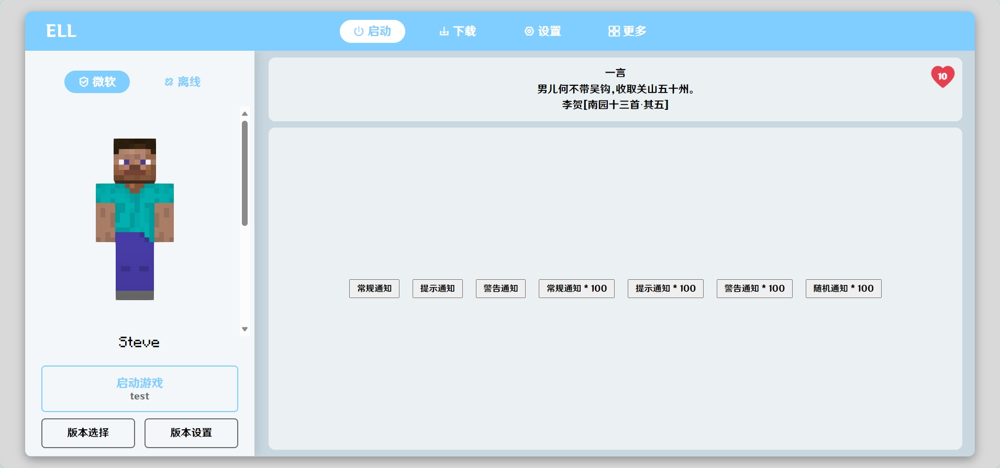

# ErhaiLakeLauncher

**洱海启动器**

这是一个用 PHP html js css 编写的 Minecraft 启动器

同时也是我正在制作的 PHP 启动器核心库的例子

## 项目负责人

- Erhai_lake
- fuzixuan0714_0826@163.com

## 功能

- 皮肤3D展示
- 一言信息获取
- 自定义主页信息
- 主题色高度自定义
- 支持全局灰度配色
- 获取 Minecraft 版本信息
- 自动拼接 Minecraft 版本 Wiki

## 贡献

### 报告问题 

- 如果你在使用项目时发现了问题,或者有改进建议,请前往 [Issues页面](https://github.com/Erhai-lake/ErhaiLakeLauncher/issues) 创建一个新的 Issue 来报告问题或提出建议.
- 请确保检查之前的 Issues ,以确保你的问题或建议尚未被其他人提交.

### 参与贡献

- 如果你想参与贡献代码,修复错误或增加新特性,请按照以下步骤进行:
  - Fork 本仓库到你自己的 GitHub 账户.
  - 创建一个新的分支,以便你可以在上面进行工作.
  - 在你的分支上进行修改或添加新的功能.
  - 确保你的代码通过了项目的测试或验证流程.
  - 提交你的更改.
  - 将你的分支推送到你的 GitHub 仓库.
  - 创建一个 Pull Request(PR) 以便将你的更改合并到主仓库.
- 请确保你的代码遵循项目的编码规范,并附上详细的描述,以便项目维护者更容易审查和接受你的 PR.

### 开发环境设置

项目环境为 PHP

Apache 或 Nginx 都可以

## 计划

- [ ] 完善下载功能
- [x] 完善设置功能
- [ ] 完善更多功能
- [ ] 完善启动游戏功能
- [ ] 完善微软登入功能
- [ ] 将所有页面接入提示框
- [x] 自动选择下载源

## 图片

### 主界面

### 3D皮肤渲染

|  |      |
| -------------------------------------------- | ---- |

### 小窗口展示

### 颜色个性化

| 全局配色 | 全局灰度 |
| :------: | :------: |
|         |          |

### 可折叠下载页

### 个性化设置

